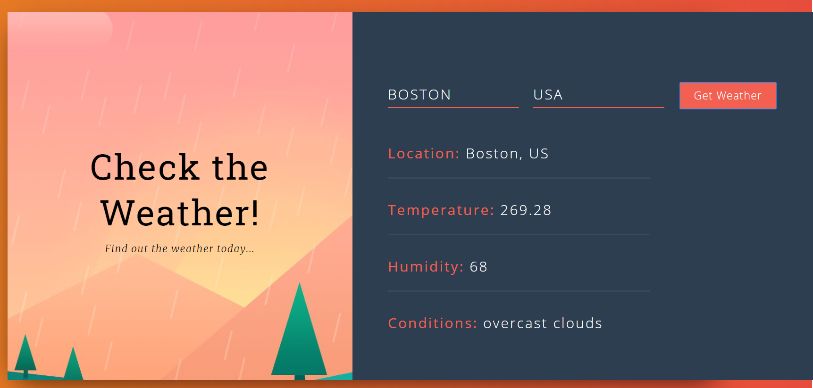

# Weather App
- Created an application which fetches weather data based on location entered by user
- Integrated a weather API into application and built the user interface with React to render data

## Screenshots
- Screenshot 1:


## Technologies

- React
- Node.js
- Bootstrap

## Requirements
- Copy the `.env.example` file into `.env` in the root directory
  ```
  cp .env.example .env
  ```
- Visit [Weather API](https://www.weatherapi.com) and register to generate your API key
- User the API key on your .env file for REACT_APP_WEATHER_APIKEY

## Node Version
- Use Node v18.*


## Building docker image
- Run the code below to build an image. you can replace `appimage` with a name of choice.
```
docker build -t appimage .
```

- Run the code below to run the image, you may change the port `8000` to a port of choice
```
docker run --name appimagecon -p 8000:80 -d appimage
```

## Deploying 
- This app is deployed over Jenkins into a Nexus Server, and from the Nexus server it is pulled into the Web server
